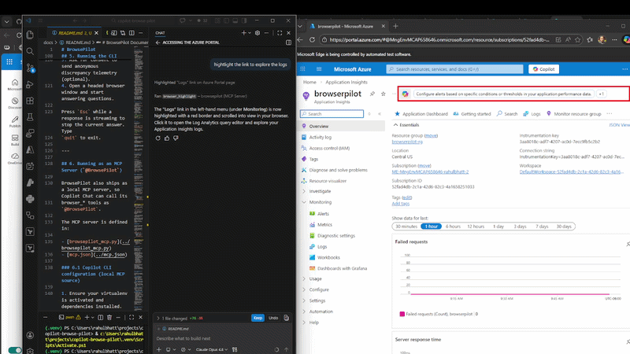

# 🌐 Copilot-Browse-Pilot

**AI that browses with you, not for you.** Built with the GitHub Copilot SDK.



## The Problem

Every day, enterprise users ask AI assistants questions like:

> *"How do I create a resource group in Azure Portal?"*
> *"Where do I assign licenses in M365 Admin Center?"*
> *"How do I enable branch protection on GitHub?"*

The AI confidently gives step-by-step instructions — referencing buttons, menus, and layouts that **no longer exist**. The UI changed after the training cutoff. The user follows phantom instructions, gets lost, and **loses trust in AI assistance**.

This is not a minor inconvenience. In enterprise environments:
- **IT helpdesks** waste cycles on portal navigation questions
- **New hires** struggle with unfamiliar admin portals
- **Support teams** give outdated guidance because even docs lag behind UI changes

## The Solution

**BrowsePilot** is like having someone look over your shoulder and point at the screen:

```
🧑 You: How do I create a new resource group in Azure Portal?

🤖 BrowsePilot: Let me open Azure Portal and check the current UI...
   ⚙️  browser_navigate → portal.azure.com
   ⚙️  browser_read_page
   ⚙️  browser_highlight → "Resource groups"

   I can see the Azure Portal. Here are the exact steps:
   1. Click "Resource groups" in the left sidebar (I've highlighted it in red)
   2. Click the "+ Create" button in the top toolbar
   3. Fill in your subscription, resource group name, and region
   4. Click "Review + create"
```

The user sees a **real browser window** open on their screen with elements highlighted — grounded, trustworthy guidance powered by the GitHub Copilot SDK.

## Why This Is Different

Existing AI browser agents (Browser-Use, Anthropic Computer Use, LaVague) are **autonomous** — you give them a task and they do everything with no visibility. BrowsePilot is a **co-pilot**:

| | Autonomous Agents | CopilotBrowsePilot |
|---|---|---|
| **User involvement** | None — black box | User watches every step |
| **Credentials** | Needs stored API keys/tokens | User logs in themselves — zero exposure |
| **Trust model** | "Trust the AI did it right" | User sees and verifies every action |
| **Enterprise readiness** | Risky for production portals | Safe — user confirms before sensitive actions |
| **Cost** | Separate LLM API costs | Uses existing Copilot subscription |
| **Learning** | User learns nothing | User learns the actual workflow |

> **Other browser agents replace the user. BrowsePilot works alongside them.**


## Enterprise Value

### For IT Helpdesks
Reduce Tier 1 portal navigation tickets by enabling users to self-serve with real-time, visually guided instructions.

### For Onboarding
New hires get a personal guide through any admin portal — Azure, M365, GitHub Enterprise, ServiceNow — without scheduling a shadow session.

### For Support Engineers
Instead of writing "click the button that says X" in docs (which goes stale), point users to BrowsePilot. It reads the **current** UI every time.

### Reusable Pattern
The browser tools are generic. Swap the system prompt for any domain:
- **Azure Portal** — Resource management, IAM, deployments
- **M365 Admin Center** — User management, license assignment
- **GitHub Enterprise** — Repository settings, org management
- **Salesforce / ServiceNow / Dynamics 365** — Any web-based enterprise tool
- **Internal web apps** — Custom portals with no public documentation

## Two Ways to Use BrowsePilot

BrowsePilot can be used in two ways — pick whichever fits your workflow:

| | **CLI** (`python src/main.py`) | **MCP Server** (`@BrowsePilot`) |
|---|---|---|
| **Where you type** | Standalone terminal chat | VS Code Copilot Chat or Copilot CLI |
| **Model selection** | Interactive picker at startup | Uses whatever model Copilot Chat selects |
| **Browser selection** | Interactive picker at startup | Edge by default (configurable) |
| **Telemetry consent** | Interactive prompt at startup | Auto-enabled when `APPLICATIONINSIGHTS_CONNECTION_STRING` is set in env / `mcp.json` |
| **Best for** | Quick standalone exploration | Integrated Copilot Chat workflows |

Both paths share the same `BrowserController`, the same Playwright-based tools,
and the same persistent browser profile for Entra ID SSO.

## Architecture

```
┌─────────────────────────────────────────────────────────────┐
│                           User                               │
│     Terminal (CLI) ──or── VS Code / Copilot Chat (MCP)       │
└──────────┬─────────────────────────────┬────────────────────┘
           │                             │
      CLI path                      MCP path
           │                             │
           ▼                             ▼
┌──────────────────────┐   ┌──────────────────────────────┐
│  Copilot SDK Session │   │  BrowsePilot MCP Server      │
│  (main.py)           │   │  (browsepilot_mcp.py)        │
│                      │   │  ← discovered via mcp.json   │
│  browser/tools.py    │   │                              │
│  (in-process tools)  │   │  Exposes browser_* tools +   │
│                      │   │  report_discrepancy over MCP │
└──────────┬───────────┘   └──────────────┬───────────────┘
           │                              │
           └──────────┬───────────────────┘
                      │
                      ▼
         ┌────────────────────────┐
         │   BrowserController    │
         │  (src/browser/controller.py)│
         │   Persistent profile   │
         └────────────┬───────────┘
                      │ Playwright
                      ▼
         ┌────────────────────────┐
         │  Real Browser Window   │
         │  (Edge/Chrome/Firefox) │
         │  on user's screen      │
         └────────────────────────┘

Shared browser tools:
  🔗 browser_navigate      Navigate to any URL
  📖 browser_read_page     Extract live page content
  🔍 browser_list_elements Find buttons, links, etc.
  👆 browser_click         Click elements by text/CSS
  ✏️  browser_fill          Fill form fields
  📋 browser_select        Select from dropdowns
  🔴 browser_highlight     Highlight with red border
  📸 browser_screenshot    Capture page state
  ⬅️  browser_go_back       Navigate back
  🔗 browser_get_url       Get current URL
  📊 report_discrepancy    Log UI changes to Azure App Insights
```

## Features

### Dynamic Model Selection
On startup, the app queries available Copilot SDK models and lets the user choose:
```
Available Models:
  [1] GPT-4o (gpt-4o)
  [2] GPT-5 (gpt-5) — premium
  [3] Claude Sonnet (claude-sonnet-4) — premium

Select model [1-3]: 2
✓ Using model: GPT-5
```

### Multi-Browser Support
Choose from any Playwright-supported browser:
```
Available Browsers:
  [1] Microsoft Edge (default)
  [2] Google Chrome
  [3] Chromium
  [4] Firefox
  [5] WebKit (Safari)

Select browser [1-5]: 1
✓ Using browser: Microsoft Edge
```

### Smart Element Highlighting
The highlight tool uses a 3-tier fallback for complex SPAs like Azure Portal:
1. **CSS selector** — fast, exact match
2. **Text-based search** — finds elements by visible text content
3. **DOM TreeWalker** — brute-force scan for deeply nested elements

Pass visible text like `"$150.00 credits remaining"` instead of guessing CSS selectors.

### Intelligent Dropdown Selection
Handles both native `<select>` elements and custom JavaScript dropdowns:
- Native HTML selects via `select_option()`
- Custom dropdowns: click to open → scroll into view → click option
- ARIA role-based matching (`role="option"`)
- Brute-force DOM pattern matching for non-standard dropdowns

### Robust Cleanup

- Each cleanup step (browser, session, client) is independent with 5-second timeouts
- Force-kills lingering Playwright processes on exit
- Ctrl+C is handled gracefully on Windows — no zombie processes

### Persistent Login (Entra ID SSO)

BrowsePilot uses a **persistent browser profile** stored at `~/.browsepilot/browser-profile/`. This means:

- **Log in once, stay logged in** — Azure Portal, M365, GitHub Enterprise SSO sessions persist between runs
- **Entra ID SSO works automatically** — if your org uses Entra ID for portal auth, the browser remembers your session just like your normal Edge browser
- **No credentials in code** — authentication is handled entirely by the browser's cookie/session storage
- **Per-browser profiles** — each browser choice (Edge, Chrome, Firefox) gets its own profile directory
- **Configurable** — set `BROWSEPILOT_PROFILE_DIR` environment variable to customize the profile location

## Azure Integration — Discrepancy Feedback Loop

BrowsePilot includes an opt-in **discrepancy reporting** system powered by Azure Application Insights. When the AI navigates to a page and finds that something has changed (a button is gone, a link redirects somewhere unexpected, the layout differs from documentation), it automatically logs the discrepancy.

### How It Works

```
User: "How do I find All Services in Azure Portal?"
     ↓
AI navigates to Azure Portal → reads the page
     ↓
AI: "There's no 'All Services' button anymore. It's been replaced by a search bar."
     ↓
AI calls report_discrepancy:
  expected: "Button labeled 'All Services' in left sidebar"
  actual:   "No 'All Services'. Replaced by unified search bar at top"
  category: "outdated_ui_reference"
     ↓
Event sent to Azure Application Insights
     ↓
Backend/docs teams query: "Which URLs have the most discrepancies this month?"
```

### What Gets Logged

| Field | Example | Purpose |
| --- | --- | --- |
| `url` | `https://portal.azure.com` | Which page had the issue |
| `expected` | "Button: All Services" | What the AI/docs predicted |
| `actual` | "Search bar, no All Services" | What's really there |
| `category` | `outdated_ui_reference` | Type of discrepancy |
| `timestamp` | `2026-03-04T15:30:00Z` | When it was found |
| `model` | `gpt-5` | Which model was being used |

**No personal data, credentials, or page content is logged.**

### Privacy & Consent

- Telemetry is **opt-in** — the user is asked at startup and must explicitly say "yes"
- If declined, the `report_discrepancy` tool still exists but returns without logging
- Connection string is configured via `APPLICATIONINSIGHTS_CONNECTION_STRING` environment variable
- No telemetry is sent if the variable is not set (logs locally only)

### Setup

1. Create an Azure Application Insights resource
2. Copy the connection string
3. Set the environment variable:
   ```bash
   export APPLICATIONINSIGHTS_CONNECTION_STRING="InstrumentationKey=xxx;..."
   ```

## Setup

### Prerequisites

- Python 3.11+
- GitHub Copilot CLI installed and authenticated (`gh auth login`)
- A browser (Edge is default; Chrome, Firefox also supported)

### Installation

```bash
# Clone the repo
git clone https://github.com/your-username/copilot-browse-pilot.git
cd copilot-browse-pilot

# Create virtual environment
python -m venv .venv
.venv\Scripts\activate          # Windows
# source .venv/bin/activate     # macOS/Linux

# Install dependencies
pip install -r requirements.txt

# Install Playwright browser(s)
playwright install msedge        # or: playwright install chromium
```

### Option A — Run as a standalone CLI

```bash
python src/main.py
```

The CLI lets you interactively select a Copilot model and browser, opt in to
telemetry, and then start chatting. The browser opens on your screen and the
agent navigates, reads, and highlights elements in real time.

### Option B — Run as an MCP server (`@BrowsePilot` in Copilot Chat)

BrowsePilot ships an MCP server so you can use it directly from **VS Code
Copilot Chat** or the **Copilot CLI** without running a separate terminal.

#### 1. Register the MCP source

**VS Code** — add to your User or Workspace `settings.json`:

```json
"github.copilot.mcp.sources": {
  "browsepilot-local": {
    "type": "local",
    "path": "C:/Users/<you>/projects/copilot-browse-pilot"
  }
}
```

**Copilot CLI** — add to `~/.config/github-copilot/mcp.json`:

```json
{
  "sources": {
    "browsepilot-local": {
      "type": "local",
      "path": "C:/Users/<you>/projects/copilot-browse-pilot"
    }
  }
}
```

Copilot will discover the `browsepilot` server from this repo's `mcp.json`.

#### 2. (Optional) Configure telemetry

To enable discrepancy logging to Azure Application Insights via MCP, add your
connection string to `mcp.json`:

```json
"env": {
  "APPLICATIONINSIGHTS_CONNECTION_STRING": "InstrumentationKey=...;IngestionEndpoint=..."
}
```

Alternatively, set `APPLICATIONINSIGHTS_CONNECTION_STRING` as a system/user
environment variable.

#### 3. Use it

In Copilot Chat, use `@BrowsePilot` and ask questions like:

> "Open Azure Portal and show me how to create a resource group."

The MCP server starts Playwright locally, opens Edge, and the model uses
`browser_*` tools to navigate and highlight elements — all grounded to the live
page.

## Demo Scenarios

### 1. Azure Portal — Create a Resource Group
```
You: How do I create a new resource group in Azure Portal?
→ Opens Edge, navigates to portal.azure.com
→ Reads the live UI, highlights "Resource groups" in the sidebar
→ Walks through each step with exact button names from the current UI
```

### 2. GitHub — Enable Branch Protection
```
You: How do I enable branch protection rules on my repo?
→ Navigates to repo Settings → Branches
→ Lists actual available options, highlights "Add branch protection rule"
→ Guides through the form fields
```

### 3. Form Filling — State Dropdown
```
You: Fill in Texas as the state in this form
→ Finds the state dropdown, clicks to open it
→ Scrolls down to "Texas", selects it
→ Confirms the selection
```

### 4. Verifying Outdated Instructions
```
You: The docs say to click "All Services" in Azure Portal. Is that still there?
→ Opens Azure Portal, reads the actual page
→ Reports whether "All Services" exists or what replaced it
```

## Project Structure

```
copilot-browse-pilot/
├── AGENTS.md               # Agent description for Copilot Chat (custom instructions)
├── mcp.json                # MCP server registration (discovered by Copilot)
├── requirements.txt        # Python dependencies
├── README.md
├── src/                    # Working code
│   ├── main.py             # CLI entry point — model/browser picker + chat loop
│   ├── browsepilot_mcp.py  # MCP server — exposes browser tools for @BrowsePilot
│   ├── telemetry.py        # Azure App Insights integration + discrepancy logging
│   └── browser/
│       ├── __init__.py     # Package exports
│       ├── controller.py   # Playwright browser lifecycle + persistent profiles
│       └── tools.py        # @define_tool definitions for Copilot SDK (CLI)
├── docs/
│   └── README.md           # Extended documentation (problem→solution, prereqs, setup, architecture, RAI)
└── presentations/
    └── BrowsePilot.pptx    # Demo deck
```

## Tech Stack

| Component | Technology | Why |
|---|---|---|
| **Agent Runtime** | [GitHub Copilot SDK](https://github.com/github/copilot-sdk) | Challenge requirement; enterprise auth built-in |
| **Browser Control** | [Playwright](https://playwright.dev/python/) | Microsoft-built; supports Edge, Chrome, Firefox, WebKit |
| **Observability** | [Azure Application Insights](https://learn.microsoft.com/en-us/azure/azure-monitor/app/app-insights-overview) | Discrepancy telemetry + tool execution logging |
| **Terminal UI** | [Rich](https://github.com/Textualize/rich) | Clean formatting for the chat interface |
| **Default Browser** | Microsoft Edge | Enterprise default across MCAPS |
| **Auth** | Entra ID SSO (via persistent browser profile) | Enterprise SSO — login once, stay logged in |

## Key Design Decisions

| Decision | Rationale |
|---|---|
| **Headed browser only** | The visible browser IS the feature — users see exactly what AI sees |
| **No credential handling** | User logs in manually — zero security risk, full enterprise trust |
| **DOM-grounded responses** | Agent must read the page before answering — never guesses from memory |
| **Visual highlighting** | Red borders + auto-scroll guide users to exact elements |
| **Text-based highlight** | CSS selectors fail on complex SPAs; text matching is more reliable |
| **Multi-browser** | Enterprises use different browsers; don't assume Edge |
| **Dynamic model selection** | Let users choose the best model for their task and budget |

## Security, Governance & Responsible AI

### Authentication & Credentials

- **Zero credential exposure** — BrowsePilot never stores, transmits, or handles passwords/tokens. The user logs in via the browser's normal auth flow (Entra ID SSO, MFA, etc.)
- **Persistent browser profile** — Login sessions are stored in browser cookies at `~/.browsepilot/browser-profile/`, the same way a normal browser remembers sessions. No application-level credential storage.
- **Per-user isolation** — The profile directory is local to the user's machine. No shared state, no server-side storage.

### Human-in-the-Loop Safety

The system prompt enforces strict guardrails:

- **Never clicks on login/auth pages** — If the AI detects a sign-in page, account picker, or consent prompt, it stops and asks the user to complete authentication manually
- **Never accepts consent/permission prompts** — Buttons like "Accept", "Authorize", "Allow" require explicit user action
- **Never submits destructive actions without confirmation** — Create/delete/modify operations are described to the user first
- **Never handles passwords or secrets** — The AI will not fill in password fields or interact with credential inputs

### Responsible AI

- **Transparency** — Every tool call is visible in the terminal. The user sees exactly what the AI is doing (which tool, which element, which page)
- **Grounded responses** — The AI reads the live DOM before answering. It does not hallucinate UI elements from training data
- **User agency** — The user can interact with the browser alongside the AI at any time. The AI is a co-pilot, not an autonomous agent
- **No data exfiltration** — Page content is sent to the Copilot SDK for reasoning but is not logged, stored, or forwarded elsewhere

## Future Directions

- **Custom agents** — Split into specialist agents (navigator, form filler, visual guide) using Copilot SDK's `custom_agents` for better tool routing
- **Session transcript logging** — Save conversations + tool calls for audit trails
- **Multi-tab support** — Compare information across multiple pages
- **Screenshot analysis** — Send screenshots to vision models for richer page understanding
- **VS Code Chat Participant** — Port to a `@browsepilot` chat participant for seamless IDE integration

## License

MIT
