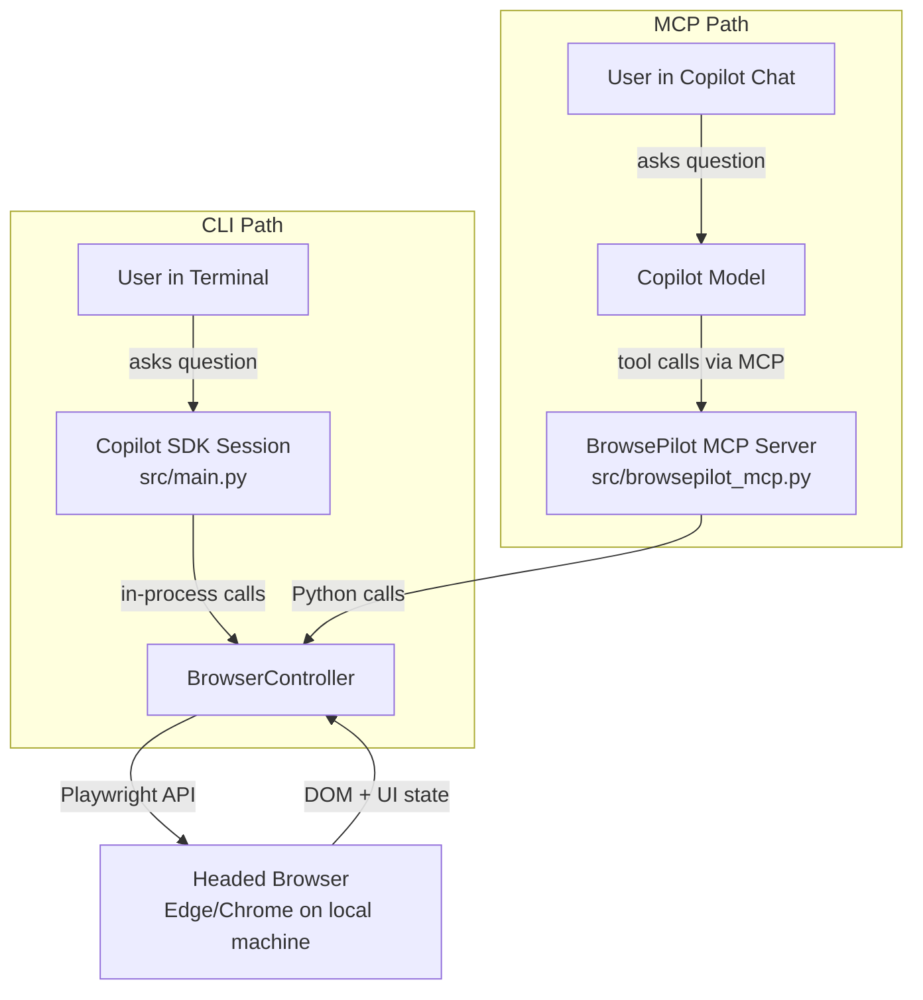

# BrowsePilot Documentation

BrowsePilot is an AI-powered browser co-pilot that uses the GitHub Copilot SDK
and Playwright to drive a real, headed browser window **on the user's
machine**. It can be used in two ways:

| | **CLI** (`python src/main.py`) | **MCP Server** (`@BrowsePilot`) |
|---|---|---|
| **Where you type** | Standalone terminal chat | VS Code Copilot Chat or Copilot CLI |
| **Model selection** | Interactive picker at startup | Uses whatever model Copilot Chat selects |
| **Browser selection** | Interactive picker at startup | Edge by default |
| **Telemetry** | Interactive opt-in prompt | Auto-enabled when `APPLICATIONINSIGHTS_CONNECTION_STRING` is set |
| **Best for** | Quick standalone exploration | Integrated Copilot Chat workflows |

Both paths share the same `BrowserController`, browser tools, persistent
browser profile (Entra ID SSO), and telemetry module.

---

## 1. Problem → Solution

**Problem.** Enterprise users constantly receive outdated, hallucinated
instructions from AI assistants about complex web portals (Azure Portal, M365
Admin Center, GitHub Enterprise, internal apps). Buttons move, menus are
renamed, and the model's training data lags behind reality.

**Solution.** Instead of guessing, BrowsePilot opens a real browser on the
user's desktop, reads the live DOM with Playwright, and gives grounded
step-by-step instructions while visually highlighting elements. The user
remains in control at all times; BrowsePilot is a co-pilot, not an autonomous
bot.

---

## 2. Architecture

High-level architecture showing both the CLI and MCP paths:



Key components:

- [src/main.py](../src/main.py) — CLI entrypoint using GitHub Copilot SDK sessions and
  the browser tools in-process.
- [src/browser/controller.py](../src/browser/controller.py) — Playwright lifecycle and
  persistent profiles (Entra SSO reuse).
- [src/browser/tools.py](../src/browser/tools.py) — GitHub Copilot SDK tool definitions
  used by the CLI agent.
- [src/browsepilot_mcp.py](../src/browsepilot_mcp.py) — FastMCP-based MCP server that
  exposes the same browser_* tools over MCP for `@BrowsePilot`.
- [mcp.json](../mcp.json) — MCP configuration registering the local
  `browsepilot` server.
- [AGENTS.md](../AGENTS.md) — natural language description of the BrowsePilot
  agent, system behavior, and tools.

Data never leaves the user's machine beyond normal Copilot usage; all
Playwright/browser control happens locally.

---

## 3. Prerequisites

- Python 3.11 or later
- Git installed
- GitHub CLI authenticated with Copilot access (`gh auth login`)
- A modern browser (Microsoft Edge by default; Chrome, Chromium, Firefox,
  WebKit supported via Playwright)
- On first run, Playwright browser binaries installed:

```bash
# From the repo root, after creating/activating a virtualenv
playwright install msedge   # or: playwright install chromium
```

---

## 4. Setup

Clone and install dependencies:

```bash
git clone https://github.com/<your-org>/copilot-browse-pilot.git
cd copilot-browse-pilot

python -m venv .venv
# Windows
.venv\\Scripts\\activate
# macOS/Linux
# source .venv/bin/activate

pip install -r requirements.txt
```

(Optional) configure Azure Application Insights for discrepancy telemetry.
This works for both CLI and MCP paths:

```bash
# PowerShell
$env:APPLICATIONINSIGHTS_CONNECTION_STRING = "InstrumentationKey=..."  

# bash/zsh
export APPLICATIONINSIGHTS_CONNECTION_STRING="InstrumentationKey=..."
```

For the MCP server specifically, you can also set this in `mcp.json`:

```json
"env": {
  "APPLICATIONINSIGHTS_CONNECTION_STRING": "InstrumentationKey=...;IngestionEndpoint=..."
}
```

- **CLI:** Telemetry is opt-in at runtime; if you decline, no data is sent.
- **MCP:** Telemetry is auto-enabled when the connection string is present in
  the environment; if it is not set, `report_discrepancy` returns without
  logging.

---

## 5. Running the CLI

Run BrowsePilot as a standalone CLI app:

```bash
python src/main.py
```

The app will:

1. Let you choose a Copilot model.
2. Let you choose a browser (Edge default).
3. Ask for consent to send anonymous discrepancy telemetry (optional).
4. Open a headed browser window and start answering questions.

Press `Esc` while a response is streaming to stop the current answer. Type
`quit` to exit.

---

## 6. Running as an MCP Server (`@BrowsePilot`)

BrowsePilot also ships as a local MCP server, so Copilot Chat can call its
browser tools as `@BrowsePilot`. The MCP server exposes all the same
`browser_*` tools **plus** `report_discrepancy`.

Relevant files:

- [src/browsepilot_mcp.py](../src/browsepilot_mcp.py) — the FastMCP server
- [mcp.json](../mcp.json) — server registration discovered by Copilot

### 6.1 Copilot CLI configuration (local MCP source)

1. Ensure your virtualenv is activated and dependencies installed.
2. Add this repo as a local MCP source in your Copilot CLI config
   (typically `~/.config/github-copilot/mcp.json`), for example:

```json
{
  "sources": {
    "browsepilot-local": {
      "type": "local",
      "path": "C:/Users/<you>/projects/copilot-browse-pilot"
    }
  }
}
```

3. Restart any `gh copilot` sessions. Copilot CLI will discover the
   `browsepilot` server from this repo's `mcp.json`.

Then, in Copilot Chat:

- Use `@BrowsePilot` (or select the BrowsePilot participant) and ask questions
  like:

> "Open Azure Portal and show me how to create a resource group."

The MCP server will start Playwright locally, open Edge, and the model will use
browser_* tools to navigate and highlight elements.

### 6.2 VS Code configuration

In VS Code (with Copilot Chat that supports MCP sources):

1. Open Settings (JSON) and add a local MCP source pointing to this repo, e.g.:

```json
"github.copilot.mcp.sources": {
  "browsepilot-local": {
    "type": "local",
    "path": "C:/Users/<you>/projects/copilot-browse-pilot"
  }
}
```

2. Reload VS Code. Copilot Chat should now list a participant for BrowsePilot
   that uses the `browsepilot` MCP server.

---

## 7. Deployment

BrowsePilot is intended to run **locally** on developer/analyst machines, not
as a cloud service:

- No server-side deployment is required beyond cloning the repo and installing
  Python dependencies.
- For teams, you can:
  - Host the repo in your org's GitHub and share setup instructions.
  - Provide a pre-configured virtual environment or container image.
  - Distribute a thin launcher script or shortcut that runs `python src/main.py`.

Because the browser and Playwright run on each user's machine, authentication
(Entra ID SSO, MFA) and cookies are handled by the local browser profile.

---

## 8. Responsible AI & Safety Notes

BrowsePilot is designed with enterprise safety in mind:

- **No credential handling** — The agent never fills password fields or stores
  tokens. Users log in via the normal browser UI.
- **No autonomous login/consent** — System prompt and tools instruct the model
  to avoid clicking on login, consent, or MFA prompts. These are left to the
  user.
- **Human-in-the-loop** — The browser is always visible and interactive. Users
  can override or stop actions at any time.
- **Telemetry is optional and minimal** — Discrepancy logging (via
  [src/telemetry.py](../src/telemetry.py)) only captures URLs, expected vs actual UI
  descriptions, and model metadata. No page content or personal data is
  recorded, and it is disabled by default unless the user opts in.

These constraints should be called out in any internal deployment or customer
pilot documentation.

---

## 9. Known Limitations / Future Work

- Single-tab browser session per MCP server process.
- No cross-page comparison or multi-window workflows yet.
- Discrepancy telemetry focuses on UI changes; richer analytics (per-tool
  success, latency) can be added later.
- A dedicated VS Code chat participant could give a nicer `@BrowsePilot`
  experience with custom prompts and quick actions.
